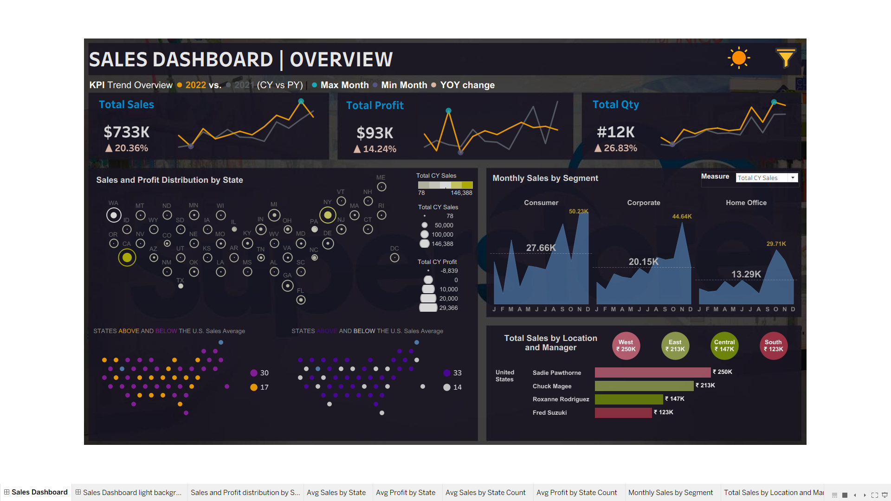

# 📊 Sales Performance Dashboard | Tableau

## 📌 Project Overview

This project presents an interactive **Sales Performance Dashboard built in Tableau** to analyze sales, profit, quantity, regional performance, state-level performance, customer segments, and monthly trends.

The dashboard transforms raw sales data into an interactive visual analytics solution that helps identify business performance patterns and high-performing regions, states, segments, and managers.

## 🎯 Business Objectives

* Analyze overall sales performance
* Track total sales, profit, and quantity
* Compare current-year performance with the previous year
* Identify monthly sales trends
* Analyze sales and profit distribution across states
* Compare performance across customer segments
* Evaluate regional sales performance
* Analyze sales by manager
* Identify states performing above and below the U.S. average
* Provide an interactive dashboard for business decision-making

## 📊 Dashboard Highlights

### KPI Overview

The dashboard provides a high-level view of:

* **Total Sales:** $733K
* **Total Profit:** $93K
* **Total Quantity:** 12K
* **Sales YoY Growth:** 20.36%
* **Profit YoY Growth:** 14.24%
* **Quantity YoY Growth:** 26.83%

### Sales & Profit by State

The dashboard uses a state-level visualization to identify geographic differences in sales and profit performance.

It highlights states performing above and below the U.S. sales average and provides a quick view of geographic sales concentration.

### Monthly Sales by Segment

Sales trends are analyzed across three major customer segments:

* Consumer
* Corporate
* Home Office

This helps identify seasonal patterns and differences in purchasing behavior between customer segments.

### Regional & Manager Performance

The dashboard compares sales across major regions:

* West
* East
* Central
* South

It also highlights the performance of individual sales managers, making it easier to identify high-performing managers and regions.

## 🛠️ Tools & Technologies

* **Tableau**
* **Microsoft Excel**
* Data Visualization
* Interactive Dashboard Design
* Calculated Fields
* Parameters
* KPI Analysis
* Geographic Analysis
* Time-Series Analysis
* Sales & Profit Analysis

## 📁 Dataset

The project uses sales data containing information related to:

* Orders
* Sales
* Profit
* Quantity
* States
* Regions
* Customer Segments
* Sales Managers
* Monthly performance

Additional geographic data is used to support the state-level visualization.

## 📂 Repository Structure

```text
Sales-Performance-Tableau-Dashboard/
│
├── README.md
├── Sales_Performance_Dashboard.twb
├── Sales_Performance_Dashboard.png
│
└── Data/
    ├── Sales_Data.xls
    └── hexmap.xlsx
```

## 📈 Key Insights

* Sales reached approximately **$733K**, showing strong overall business performance.
* Total profit reached approximately **$93K**.
* Quantity increased by approximately **26.83% year over year**, indicating strong growth in sales volume.
* Sales increased by approximately **20.36% year over year**.
* Profit increased by approximately **14.24% year over year**.
* The **Consumer segment** represents a significant portion of monthly sales.
* Regional analysis highlights differences in sales contribution across the West, East, Central, and South regions.
* State-level analysis helps identify geographic markets performing above or below the national sales average.
* Manager-level analysis provides visibility into individual sales performance.

## 💡 Business Value

This dashboard can help sales and business teams:

* Monitor sales KPIs
* Identify growth opportunities
* Detect underperforming regions
* Compare customer segments
* Evaluate manager performance
* Understand seasonal sales patterns
* Support data-driven sales strategies

## 🖼️ Dashboard Preview



## 🚀 Project Outcome

This project demonstrates the ability to transform raw business data into an interactive Tableau dashboard and communicate key business insights through effective data visualization.

It showcases practical skills in **data analysis, dashboard development, KPI tracking, geographic analysis, trend analysis, and business storytelling**.

---

### 👤 Author

**Somya Singhal**

Data Analyst | Tableau | Power BI | Excel | SQL
